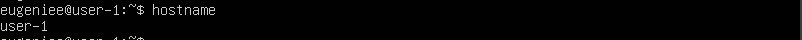
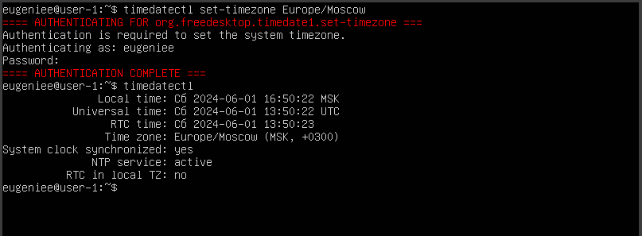
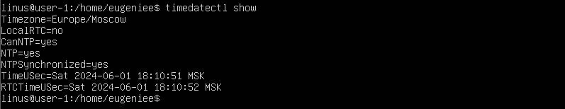
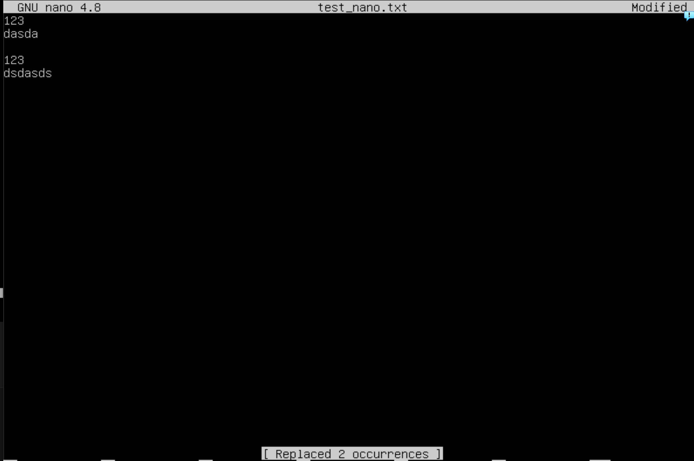
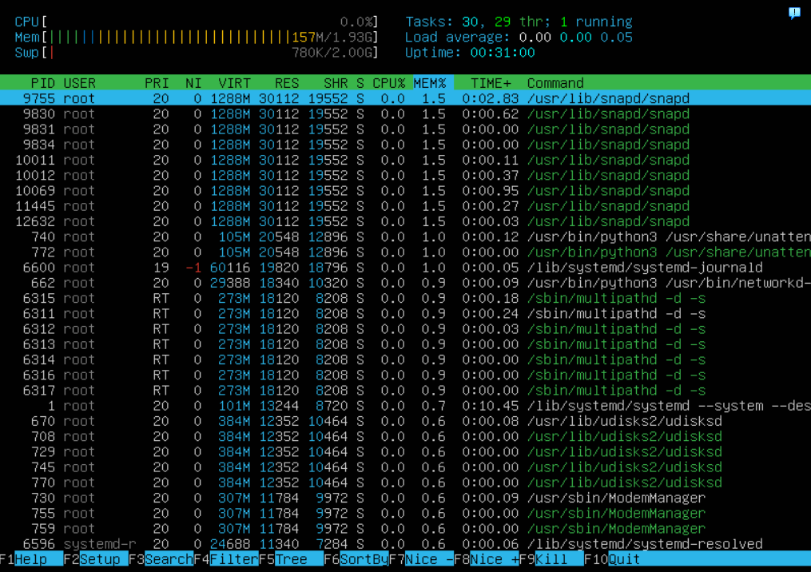

## Part 1. Установка ОС

##### Установи **Ubuntu 20.04 Server LTS** без графического интерфейса. (Используем программу для виртуализации - VirtualBox)

## Part 2. Создание пользователя

##### Создай пользователя, отличного от созданного при установке. Пользователь должен быть добавлен в группу `adm`.

Вставь скриншот вызова команды для создания пользователя.

Новый пользователь должен быть в выводе команды \
`cat /etc/passwd`
- Вставь скриншот с выводом команды.

## Part 3. Настройка сети ОС

##### 1.Задай название машины вида user-1.

##### 2.Установи временную зону, соответствующую твоему текущему местоположению.

##### 3.Выведи названия сетевых интерфейсов с помощью консольной команды.

 - `lo (loopback device)` – виртуальный интерфейс, присутствующий по умолчанию в любом Linux. Он используется для отладки сетевых программ и запуска серверных приложений на локальной машине. С этим интерфейсом всегда связан адрес 127.0.0.1. У него есть dns-имя – localhost. Посмотреть привязку можно в файле /etc/hosts.

##### 4.Используя консольную команду, получи ip адрес устройства, на котором ты работаешь, от DHCP сервера. 

- `DHCP` - это клиент-серверный протокол динамической конфигурации хоста (Dynamic Host Configuration Protocol), с помощью которого в ИТ-инфраструктуре сетевые параметры каждого нового устройства прописываются автоматически. Использование DHCP существенно упрощает работу системных администраторов в случаях расширения сети.

##### Определи и выведи на экран внешний ip-адрес шлюза (ip) и внутренний IP-адрес шлюза, он же ip-адрес по умолчанию (gw). 

##### Внутренний IP-адрес шлюза

##### Внешний ip-адрес шлюза

##### Задай статичные (заданные вручную, а не полученные от DHCP сервера) настройки ip, gw, dns (используй публичный DNS серверы, например 1.1.1.1 или 8.8.8.8).  

##### Перезагрузи виртуальную машину. Убедись, что статичные сетевые настройки (ip, gw, dns) соответствуют заданным в предыдущем пункте. 

##### Успешно пропингуй удаленные хосты 1.1.1.1 и ya.ru и вставь в отчёт скрин с выводом команды. В выводе команды должна быть фраза «0% packet loss».

## Part 4. Обновление ОС

##### Обнови системные пакеты до последней на момент выполнения задания версии. 

##### После обновления системных пакетов, если ввести команду обновления повторно, должно появиться сообщение, что обновления отсутствуют

## Part 5. Использование команды **sudo**

##### Разреши пользователю, созданному в [Part 2](#part-2-создание-пользователя),выполнять команду sudo.

- Команда sudo ( substitute user and do, подменить пользователя и выполнить ) позволяет строго определенным пользователям выполнять указанные программы с административными привилегиями без ввода пароля суперпользователя root. 

## Part 6. Установка и настройка службы времени

##### Настрой службу автоматической синхронизации времени.  

- Вывод следующей команды должен содержать `NTPSynchronized=yes`: \
  `timedatectl show`

  

## Part 7. Установка и использование текстовых редакторов 

##### Используя каждый из трех выбранных редакторов, создай файл *test_X.txt*, где X -- название редактора, в котором создан файл. Напиши в нём свой никнейм, закрой файл с сохранением изменений.  

## NANO

`CTRL+X`
`Y`
`Enter`
## VIM

`ESC`
`:wq`

## JOE

`CTRL+K`
`X`

##### Используя каждый из трех выбранных редакторов, открой файл на редактирование, отредактируй файл, заменив никнейм на строку «21 School 21», закрой файл без сохранения изменений.

## NANO

`CTRL+X`
`n`

## VIM

`ESC`
`:q!`

## JOE

`CTRL+C`
`y`

##### Используя каждый из трех выбранных редакторов, отредактируй файл ещё раз (по аналогии с предыдущим пунктом), а затем освой функции поиска по содержимому файла (слово) и замены слова на любое другое.

## NANO_поиск

`CTRL+W`
## NANO_замена

`CTRL+W`
`CTRL+R`

## VIM_поиск

`:/(пример для поиска)`

## VIM_замена

`:%s/(слово для замены)/(заменяющее слово)`

## JOE_поиск

`CTRL+K`
`F`
`(слово для поиска)`
`x`

## JOE_замена

`CTRL+K`
`F`
`(слово для замены)`
`r`
`(заменяющее слово)`

## Part 8. Установка и базовая настройка сервиса **SSHD**

##### Установи службу SSHd.

`sudo apt install ssh`
`sudo apt install sshd`

##### Добавь автостарт службы при загрузке системы.  

##### Перенастрой службу SSHd на порт 2022. 

##### Используя команду ps, покажи наличие процесса sshd. Для этого к команде нужно подобрать ключи.

##### `Команда ps выводит список текущих процессов на вашем сервере в виде таблицы, с которой можно удобно работать: сортировать, изменять количество колонок и прочие. У утилиты ps множество настроек, с помощью которых можно тонко настраивать вывод команды, также никто не запрещает вам делать конвейеры, чтобы отсечь всё лишнее.`

- `A, -e, (a)` - выбрать все процессы;
- `a` - выбрать все процессы, кроме фоновых;
- `d, (g)` - выбрать все процессы, даже фоновые, кроме процессов сессий;
- `N` - выбрать все процессы кроме указанных;
- `С` - выбирать процессы по имени команды;
- `G` - выбрать процессы по ID группы;
- `p, (p)` - выбрать процессы PID;
- `--ppid` - выбрать процессы по PID родительского процесса;
- `s` - выбрать процессы по ID сессии;
- `t, (t)` - выбрать процессы по tty;
- `u, (U)` - выбрать процессы пользователя.

Вывод команды netstat -tan должен содержать  \
`tcp 0 0 0.0.0.0:2022 0.0.0.0:* LISTEN`  \

- `-a` Отображение всех подключений и ожидающих портов.
- `-n` Отображение адресов и номеров портов в числовом формате.
- `-t` Отображение текущего подключения в состоянии переноса нагрузки с процессора на сетевой адаптер при передаче данных ( "offload" ).
- `Proto` -  Протокол (tcp, udp, raw), используемый сокетом.
- `Local address` - локальный IP-адрес участвующий в соединении или связанный со службой, ожидающей входящие соединения (слушающей порт). Если в качестве адреса отображается 0.0.0.0 , то это означает - "любой адрес", т.е в соединении могут использоваться все IP-адреса существующие на данном компьютере. Адрес 127.0.0.1 - это петлевой интерфейс, используемый в качестве средства IP протокола для взаимодействия между процессами без реальной передачи данных.
- `Foreign address` - Адрес и номер порта удалённого конца сокета. Аналогично "Local Address."
- `Recv-Q` - Счётчик байт не скопированных программой пользователя из этого сокета.
- `Send-Q` - Счётчик байтов, не подтверждённых удалённым узлом.
- `State` - состояние соединения.
- ``CLOSE_WAIT`` - ожидание закрытия соединения.
- ``CLOSED`` - соединение закрыто.
- ``ESTABLISHED`` - соединение установлено.
- ``LISTENING`` - ожидается соединение (слушается порт)
- ``TIME_WAIT`` - превышение времени ответа.

## Part 9. Установка и использование утилит **top**, **htop**

##### Установи и запусти утилиты top и htop.  
## top

- По выводу команды top определи и напиши в отчёте:

  - `uptime` = 10 min
  - `количество авторизованных пользователей` = 1 user
  - `общую загрузку системы` = 0.00, 0.29, 0.25
  - `общее количество процессов` = 97 total
  - `загрузку cpu` = 0.0
  - `загрузку памяти` = 153,8 used
  - pid процесса занимающего больше всего памяти

  

  9755

  - pid процесса, занимающего больше всего процессорного времени

  

  1
## htop
  - В отчёт вставь скрин с выводом команды htop:
  - отсортированному по PID, PERCENT_CPU, PERCENT_MEM, TIME
  - PID

  

  - PERCENT_CPU

   

  - PERCENT_MEM

  

  - TIME

  
  - отфильтрованному для процесса sshd
  
  - с процессом syslog, найденным, используя поиск 
  
  - с добавленным выводом hostname, clock и uptime  
  

## Part 10. Использование утилиты **fdisk**
- `название жесткого диска` - sda
- `размер` - 25GB
- `количество секторов` - 52428800
- 2GB

## Part 11. Использование утилиты **df** 

##### Команда df.

  - `размер раздела` - 11758760 KB
  - `размер занятого пространства` - 4764936 KB
  - `размер свободного пространства` - 6374716 KB
  - `процент использования` - 43%

##### Команда df -Th.
  - `Тип файловой системы:` ext4
  - `размер раздела `- 12G
  - `размер занятого пространства` - 4,6G
  - `размер свободного пространства` - 6,1G
  - `процент использования` - 43%

## Part 12. Использование утилиты **du**

##### Запусти команду du
##### Размер папок /home, /var, /var/log (в байтах, в человекочитаемом виде)

### в байтах

### в человекочитаемом виде

##### Размер всего содержимого в /var/log

## Part 13. Установка и использование утилиты **ncdu**

## Part 14. Работа с системными журналами

- `метод` - LOGIN
- `имя` - eugeniee
- `время` - 17:22:54

- Перезапусти службу SSHd;
- Вставь в отчёт скрин с сообщением о рестарте службы (искать в логах).

## Part 15. Использование планировщика заданий **CRON**
##### Используя планировщик заданий, запусти команду uptime через каждые 2 минуты.
- Найди в системных журналах строчки (минимум две в заданном временном диапазоне) о выполнении;

- Выведи на экран список текущих заданий для CRON;

##### Удали все задания из планировщика заданий.
