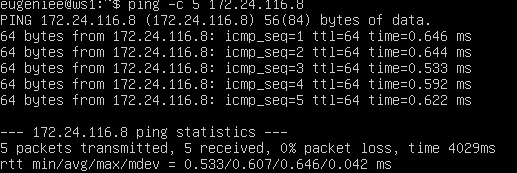
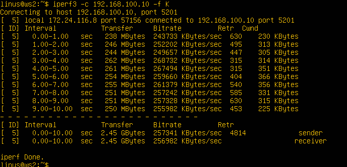
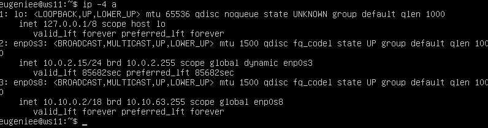

## Contents :book:
   1. [Инструмент ipcalc](#part-1-инструмент-ipcalc) 
   2. [Статическая маршрутизация между двумя машинами](#part-2-статическая-маршрутизация-между-двумя-машинами) 
   3. [Утилита iperf3](#part-3-утилита-iperf3) 
   4. [Сетевой экран](#part-4-сетевой-экран) 
   5. [Статическая маршрутизация сети](#part-5-статическая-маршрутизация-сети) 
   6. [Динамическая настройка IP с помощью DHCP](#part-6-динамическая-настройка-ip-с-помощью-dhcp) 
   7. [NAT](#part-7-nat) 
   8. [Допополнительно. Знакомство с SSH Tunnels](#part-8-дополнительно-знакомство-с-ssh-tunnels)


## Part 1. Инструмент **ipcalc**
#### 1.1. Сети и маски
##### 1) Адрес сети *192.167.38.54/13* - *192.160.0.0*

##### 2.1) Перевод маски *255.255.255.0* в префиксную и двоичную запись - */24*,*11111111.11111111.11111111.00000000*

##### 2.2) */15* в обычную и двоичную - *255.254.0.0*,*11111111.11111110.00000000.00000000*

##### 2.3) *11111111.11111111.11111111.11110000* в обычную и префиксную - *255.255.255.240*, */28*


##### 3) Минимальный и максимальный хост в сети *12.167.38.4* при масках:
##### 3.1)*/8* - min(12.0.0.1),max(12.255.255.254)

##### 3.2)*11111111.11111111.00000000.00000000* - min(12.167.0.1),max(12.167.255.254)

##### 3.3)*255.255.254.0* - min(12.167.38.1),max(12.167.39.254)

##### 3.4)*/4* - min(0.0.0.1),max(15.255.255.254)


#### 1.2. localhost

##### Можно ли обратиться к приложению, работающему на localhost, со следующими IP: 
###### localhost - это так называемый локальный хост. Можно сказать, что обращаясь к localhost вы обращаетесь к тому же самому компьютеру, на котором сейчас работаете. Вот диапазон IP-адресов, которые предназначены для создания локальных сетей. *127.0.0.1 - 127.255.255.255*
##### *194.34.23.100* - нет, не входит в диапозон
##### *127.0.0.2* - да
##### *127.1.0.1* - да
##### *128.0.0.1* - нет,не входит в диапозон

#### 1.3. Диапазоны и сегменты сетей

##### 1) Какие из перечисленных IP можно использовать в качестве публичного, а какие только в качестве частных:
##### Публичные: *134.43.0.2*,*172.20.250.4*,*172.0.2.1*,*192.172.0.1*, *172.68.0.2*, *192.169.168.1*
##### Частные: *10.0.0.45*, *192.168.4.2*, *172.16.255.255*, *10.10.10.10*,
##### 2) Какие из перечисленных IP адресов шлюза возможны у сети *10.10.0.0/18*: 
- *10.10.0.2*
- *10.10.10.10*
- *10.10.1.255*

## Part 2. Статическая маршрутизация между двумя машинами

##### С помощью команды `ip a` посмотри существующие сетевые интерфейсы.


##### Опиши сетевой интерфейс, соответствующий внутренней сети, на обеих машинах и задать следующие адреса и маски: ws1 - *192.168.100.10*, маска */16*, ws2 - *172.24.116.8*, маска */12*.

###### ws1


###### ws2


##### Выполни команду `netplan apply` для перезапуска сервиса сети.
- 
- 


#### 2.1. Добавление статического маршрута вручную
##### Добавь статический маршрут от одной машины до другой и обратно при помощи команды вида `ip r add`.
- 
- 
##### Пропингуй соединение между машинами.
- 
- 


##### Добавь статический маршрут от одной машины до другой с помощью файла *etc/netplan/00-installer-config.yaml*.
- 
- 
##### Пропингуй соединение между машинами.
- 
- 

## Part 3. Утилита **iperf3**

#### 3.1. Скорость соединения


##### Переведи и запиши в отчёт: 8 Mbps в MB/s, 100 MB/s в Kbps, 1 Gbps в Mbps.
##### 8 Mbps в MB -  1MB
##### 100 MB в Kbps - 800000 
##### 1 Gbps в Mbps - 1000 

#### 3.2. Утилита **iperf3**
##### Измерь скорость соединения между ws1 и ws2.




## Part 4. Сетевой экран

#### 4.1. Утилита **iptables**
##### Создай файл */etc/firewall.sh*, имитирующий фаерволл, на ws1 и ws2:
```shell
#!/bin/sh

# Удаление всех правил в таблице «filter» (по-умолчанию).
iptables -F
iptables -X
```

##### Нужно добавить в файл подряд следующие правила:
##### 1) На ws1 примени стратегию, когда в начале пишется запрещающее правило, а в конце пишется разрешающее правило (это касается пунктов 4 и 5).


##### 2) На ws2 примени стратегию, когда в начале пишется разрешающее правило, а в конце пишется запрещающее правило (это касается пунктов 4 и 5).


##### Запусти файлы на обеих машинах командами `chmod +x /etc/firewall.sh` и `/etc/firewall.sh`.


- В первом файле (ws1) применяется стратегия, при которой сначала устанавливается запрещающее правило для echo reply, а затем разрешающее. Это означает, что по умолчанию машина не будет отвечать на ping, но последующее разрешающее правило позволит ей это делать.

- Во втором файле (ws2) применяется стратегия, при которой сначала устанавливаются разрешающие правила для портов 22 и 80, а также для echo reply, а затем следует запрещающее правило для echo reply. В этом случае, поскольку разрешающее правило для echo reply стоит выше в списке, машина будет отвечать на ping, а запрещающее правило не будет иметь эффекта, так как пакеты уже будут разрешены.

#### 4.2. Утилита **nmap**
##### Командой **ping** найди машину, которая не «пингуется», после чего утилитой **nmap** покажи, что хост машины запущен.


## Part 5. Статическая маршрутизация сети

`-` Пока что мы соединяли всего две машины, но теперь пришло время для статической маршрутизации целой сети.

**== Задание ==**
##### Подними пять виртуальных машин (3 рабочие станции (ws11, ws21, ws22) и 2 роутера (r1, r2)).

#### 5.1. Настройка адресов машин
##### Настрой конфигурации машин в *etc/netplan/00-installer-config.yaml* согласно сети на рисунке.


- R1 & WS11


- R2


- WS22 & WS 21


##### Перезапусти сервис сети. Если ошибок нет, то командой `ip -4 a` проверь, что адрес машины задан верно. Также пропингуй ws22 с ws21. Аналогично пропингуй r1 с ws11.
`ip -4 a`
- r1


- ws11




- r2


- ws22


- ws21


`ping`
- ws21 - ws22


- ws11 - r1


--------------------------------------------

#### 5.2. Включение переадресации IP-адресов
##### Для включения переадресации IP, выполни команду на роутерах:
`sysctl -w net.ipv4.ip_forward=1`
*При таком подходе переадресация не будет работать после перезагрузки системы.*


##### Открой файл */etc/sysctl.conf* и добавь в него следующую строку:
`net.ipv4.ip_forward = 1`
*При использовании этого подхода, IP-переадресация включена на постоянной основе.*


--------------------------------------------

##### Настрой маршрут по-умолчанию (шлюз) для рабочих станций. Для этого добавь `default` перед IP роутера в файле конфигураций.


##### Вызови `ip r` и покажи, что добавился маршрут в таблицу маршрутизации.


##### Пропингуй с ws11 роутер r2 и покажи на r2, что пинг доходит. Для этого используй команду:
`tcpdump -tn -i eth0`


#### 5.4. Добавление статических маршрутов
##### Добавь в роутеры r1 и r2 статические маршруты в файле конфигураций. Пример для r1 маршрута в сетку 10.20.0.0/26:
```shell
# Добавь в конец описания сетевого интерфейса eth1:
- to: 10.20.0.0
  via: 10.100.0.12
```


##### Вызови `ip r` и покажи таблицы с маршрутами на обоих роутерах.


##### Запусти команды на ws11:
`ip r list 10.10.0.0/[маска сети]` и `ip r list 0.0.0.0/0`
- Если для адреса 10.10.0.0/[маска сети] был выбран маршрут, отличный от 0.0.0.0/0, это означает, что в таблице маршрутизации есть более конкретный маршрут для этой подсети, который имеет больший приоритет, чем маршрут по умолчанию.


#### 5.5. Построение списка маршрутизаторов

##### Запусти на r1 команду дампа:
`tcpdump -tnv -i eth0`
##### При помощи утилиты **traceroute** построй список маршрутизаторов на пути от ws11 до ws21.


- Команда **traceroute** используется для определения маршрута, который проходит пакет от источника к назначению. При этом, traceroute отправляет последовательность пакетов с увеличивающимся значением TTL (Time to Live), которое определяет максимальное количество маршрутизаторов, через которые может пройти пакет.


#### 5.6. Использование протокола **ICMP** при маршрутизации
##### Запусти на r1 перехват сетевого трафика, проходящего через eth0 с помощью команды:
`tcpdump -n -i eth0 icmp`
##### Пропингуй с ws11 несуществующий IP (например, *10.30.0.111*) с помощью команды:
`ping -c 1 10.30.0.111`


## Part 6. Динамическая настройка IP с помощью **DHCP**

##### Для r2 настрой в файле */etc/dhcp/dhcpd.conf* конфигурацию службы **DHCP**:
##### 1) Укажи адрес маршрутизатора по-умолчанию, DNS-сервер и адрес внутренней сети. Пример файла для r2:
```shell
subnet 10.100.0.0 netmask 255.255.0.0 {}

subnet 10.20.0.0 netmask 255.255.255.192
{
    range 10.20.0.2 10.20.0.50;
    option routers 10.20.0.1;
    option domain-name-servers 10.20.0.1;
}
```
##### 2) В файле *resolv.conf* пропиши `nameserver 8.8.8.8`.


##### Перезагрузи службу **DHCP** командой `systemctl restart isc-dhcp-server`. Машину ws21 перезагрузи при помощи `reboot` и через `ip a` покажи, что она получила адрес. Также пропингуй ws22 с ws21.


##### Укажи MAC адрес у ws11, для этого в *etc/netplan/00-installer-config.yaml* надо добавить строки: `macaddress: 10:10:10:10:10:BA`, `dhcp4: true`.


##### Для r1 настрой аналогично r2, но сделай выдачу адресов с жесткой привязкой к MAC-адресу (ws11). Проведи аналогичные тесты.

- Укажем адрес маршрутизатора по-умолчанию,адрес внутренней сети. По аналогии r2


- Зададим правила для жесткой маски


- Укажем DNS


- Перезапускаем ws11, в настройках сети  ВМ указываем наш МАК-адрес


- Появился динамический Ip с жесткой привязкой МАК-адреса


##### Запроси с ws21 обновление ip адреса.


 - 


  - 


## Part 7. **NAT**

##### В файле */etc/apache2/ports.conf* на ws22 и r1 измени строку `Listen 80` на `Listen 0.0.0.0:80`, то есть сделай сервер Apache2 общедоступным.


##### Запусти веб-сервер Apache командой `service apache2 start` на ws22 и r1.


##### Добавь в фаервол, созданный по аналогии с фаерволом из Части 4, на r2 следующие правила:
##### 1) Удаление правил в таблице filter - `iptables -F`;
##### 2) Удаление правил в таблице "NAT" - `iptables -F -t nat`;
##### 3) Отбрасывать все маршрутизируемые пакеты - `iptables --policy FORWARD DROP`.
##### Запусти файл также, как в Части 4.
##### Проверь соединение между ws22 и r1 командой `ping`.


*При запуске файла с этими правилами, ws22 не должна «пинговаться» с r1.*


##### Добавь в файл ещё одно правило:
##### 4) Разрешить маршрутизацию всех пакетов протокола **ICMP**.
##### Запусти файл также, как в Части 4.
##### Проверь соединение между ws22 и r1 командой `ping`.


*При запуске файла с этими правилами, ws22 должна «пинговаться» с r1.*


##### Добавь в файл ещё два правила:
##### 5) Включи **SNAT**, а именно маскирование всех локальных ip из локальной сети, находящейся за r2 (по обозначениям из Части 5 - сеть 10.20.0.0).
##### 6) Включи **DNAT** на 8080 порт машины r2 и добавить к веб-серверу Apache, запущенному на ws22, доступ извне сети.


##### Проверь соединение по TCP для **SNAT**: для этого с ws22 подключиться к серверу Apache на r1 командой:
```telnet [адрес] [порт]```


##### Проверь соединение по TCP для **DNAT**: для этого с r1 подключиться к серверу Apache на ws22 командой ```telnet``` (обращаться по адресу r2 и порту 8080).


## Part 8. Дополнительно. Знакомство с **SSH Tunnels**


##### Запусти на r2 фаервол с правилами из Части 7.
##### Запусти веб-сервер **Apache** на ws22 только на localhost (то есть в файле */etc/apache2/ports.conf* измени строку ```Listen 80``` на ```Listen localhost:80```).


##### Воспользуйся *Local TCP forwarding* с ws21 до ws22, чтобы получить доступ к веб-серверу на ws22 с ws21.


##### Воспользуйся *Remote TCP forwarding* c ws11 до ws22, чтобы получить доступ к веб-серверу на ws22 с ws11.


##### Для проверки, сработало ли подключение в обоих предыдущих пунктах, перейди во второй терминал (например, клавишами Alt + F2) и выполни команду:


:smile: :blush: :school: