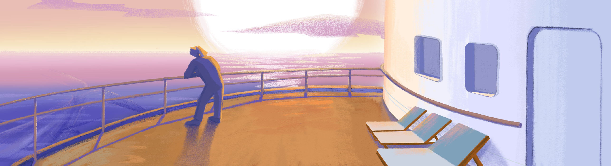

# School21
    Тут находятся проекты с обучения в Школе 21
## Contents :book:
   1. [C_projects](#C_projects) 
      - [Brickgame](#Brickgame) 
      - [Matrix](#Matrix)

# C_projects :skull:

### Brickgame
    Резюме: в данном проекте предстоит реализовать игру «Тетрис» на языке программирования С с использованием структурного подхода.
[Brickgame](<https://github.com/frastyfeet/School21/tree/main/C7_BrickGame_v1.0-1>)

### Matrix
    Реализация библиотеки matrix.h.
[Matrix](<https://github.com/frastyfeet/School21/tree/main/C7_BrickGame_v1.0-1>)